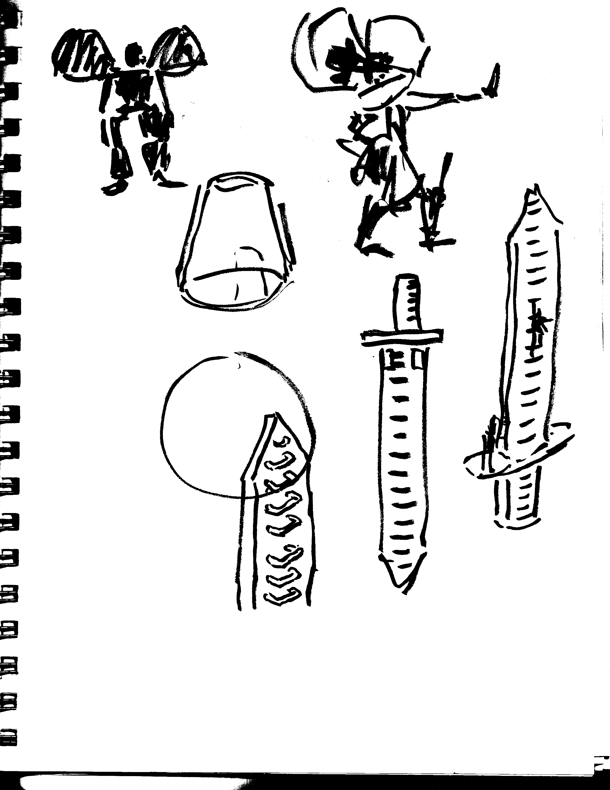
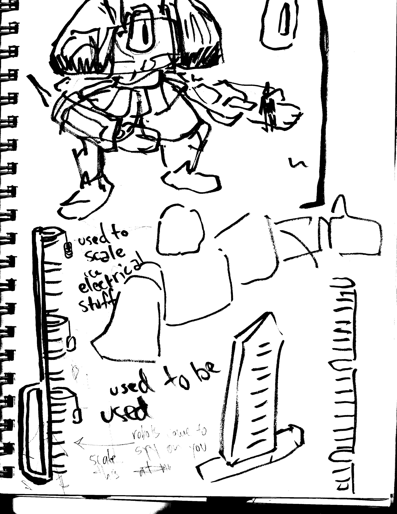
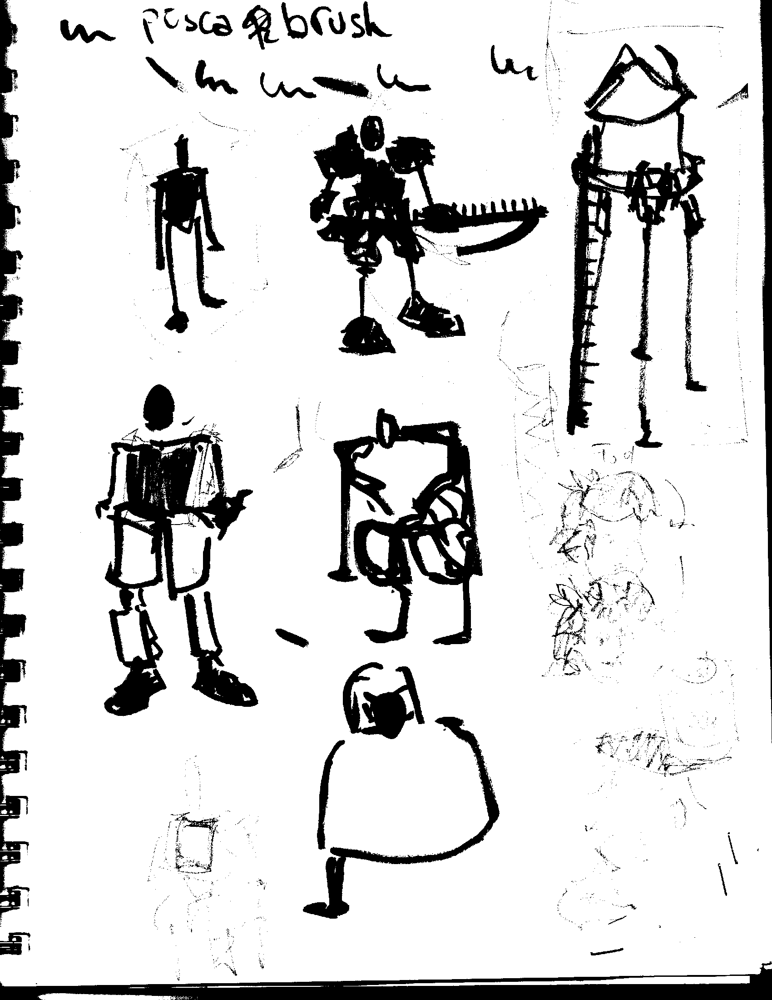
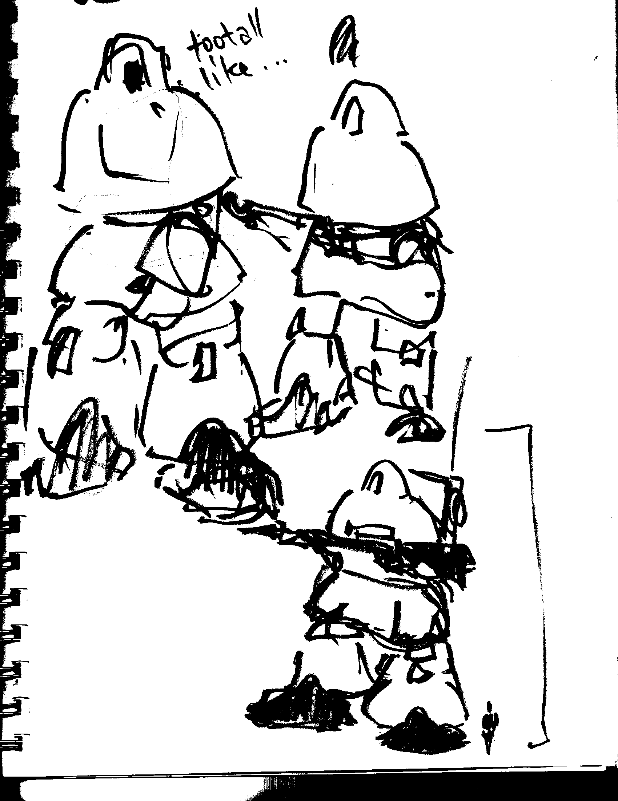
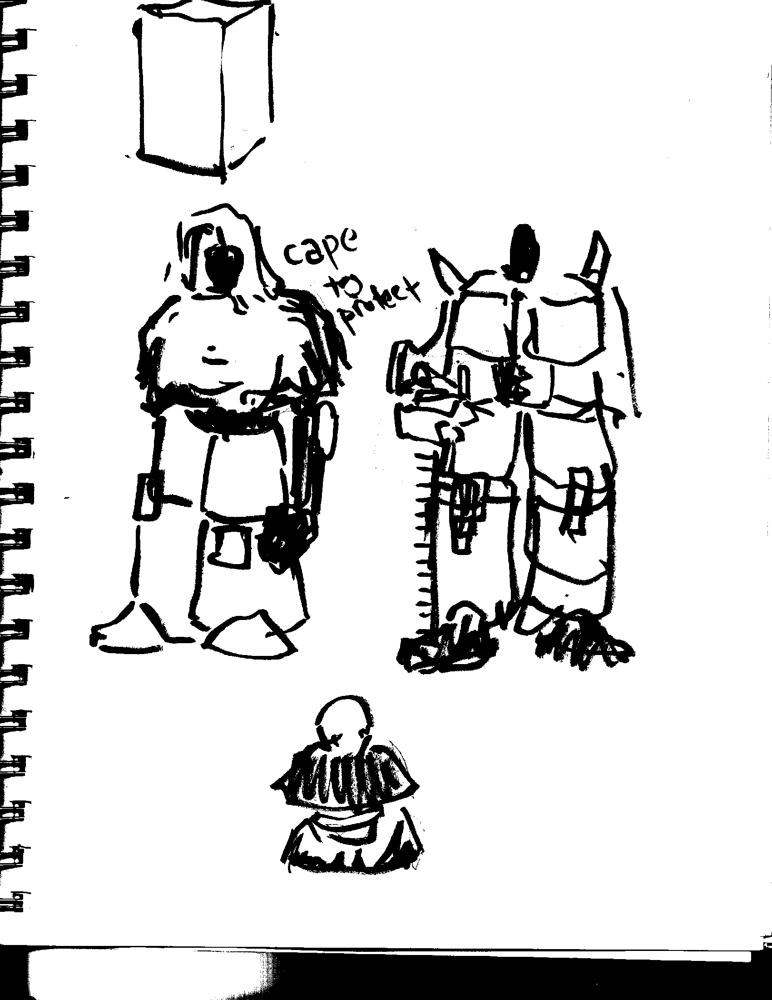
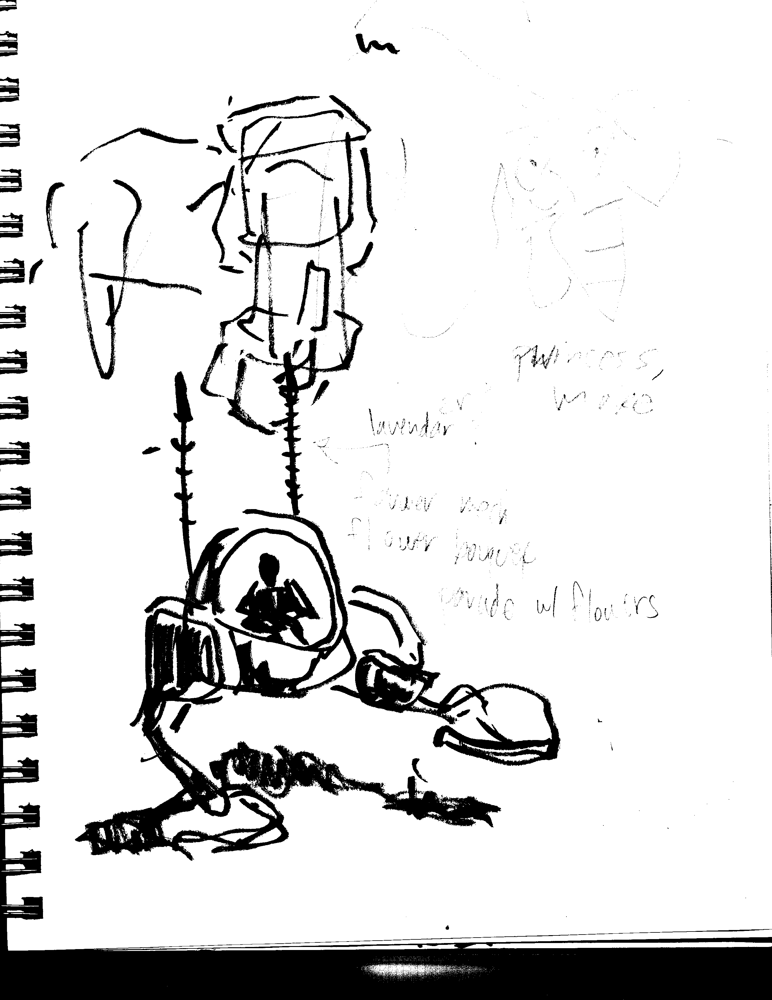
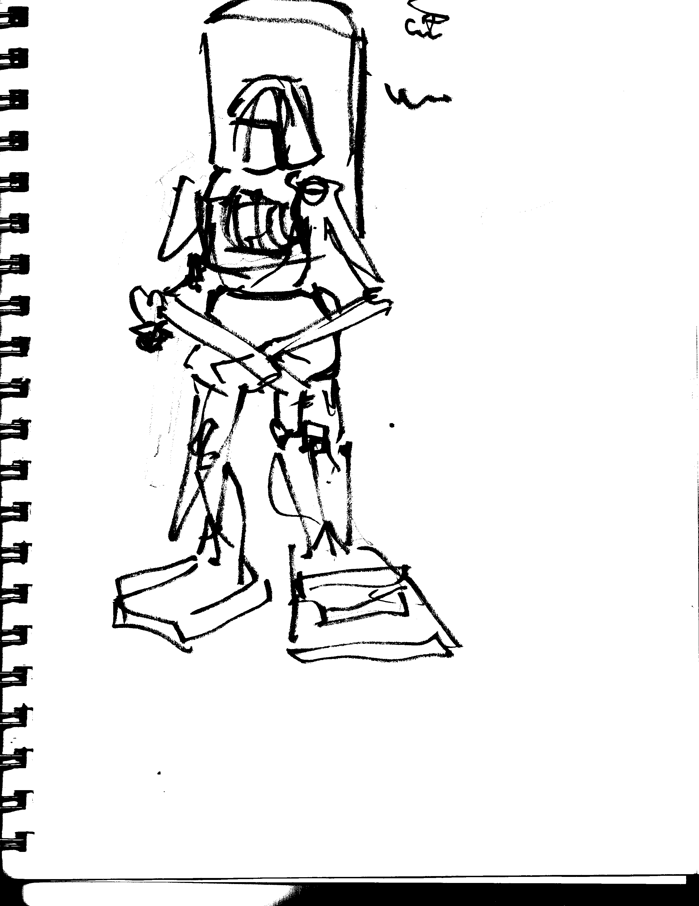

# Weekend of 1-24 concepts
## Initial thoughts
I had a lot fun making all of these sketches! Again, I cannot stress enough that I have no idea what I am doing, but that is ok! I started out by trying to get some basic silhouettes, and trying to make sure that the mobile suits looked cool, and also had a purpose in the world.

I think the one idea that compelled me the most when making these designs is that the pilots that the mockumentary follows used to be young adults just doing whatever (like what you and I currently do), but joing BIG BRO puts them in situations where they become congnisant that they are the enemy that they used to be so adamently against. In order to hold on to as much of their previous life as they can, in their downtime, they use their mobile suits to just fuck around, and try to act like all of their friends who didn't have to join BIG BRO. I think a great aid to this is to give the mobile suits these tools designed for military purposes (crowd control, scaling buildings, providing cover to foot soldiers, etc.) but when the mobile suits are not on the frontline, the pilors could use these tools for doing juvenile things. I'll explain with some examples from the sketches.

## sketches

> the top most mobile suit has 2 big clear cups attatched to it's shoulders, providing it with a crowd control tool, where it can put the domes over groups of people to contain them. I then imagined that the pilots could sneak off and use these to like hotbox or have parties in the woods. This is one example of what I mean when the pilots use the military technology for their own juvenile purposes. They could one day be faced with the horrors of having to put people in cages one day during their job, and then also reuse the same technology to act like a 20 something year old. HOWEVER I deemed this is a BAD idea since, while the image started as very funny, this specific example is reminicent of imagery of filling up confined spaces with gas by the military, which is... not a great thing to make light of.

> The ladder sword is much more light hearted. It's intent is as a weapon by the mobile suits, but when placed down, it allows soldiers to scale buildings. The pilots in BIG BRO could use it go off in the wilderness and scale cliffs/water towers to get nice views. I like the design in the second image with the lanterns hanging from ladder rungs, for I think it creates a nice image of a mobile suit marching, with the *clang* *clang* of the metal lantern against the sword.

> Really loving the look of mobile suits wearing capes. I imagine in the fiction, these mobile suits are extremely old and and used, and the capes protect exposed electronics from short circuiting if it rains. The pilots would probably be very frustrated that the military is making their job even more dangerous by not taking proper precautions with old mobile suits.

>Misc other designs. Chicken looking mobile suit up top. Mobile suit dressed in crop top, high waisted shorts, and paint gun. I imagine it as the "art hoe" of mobile suits. One final note on mobile suits wearing clothes. I think that in their down time, the pilots use found material in whatever city they are stationed to make clothes for their mobile suits to express the pilots personality (I imagine the higher ups in the military don't really care, as long as they complete tasks when ordered to do so). However, while personalizing your mobile suit may seem fun while you're just walking on patrol, or on break, it gains a much more sinister look as soon as you're forced to crime against humanity. For example, if you outfit your mobile suit to wear your favorite band's t-shirt, when you have to do crowd control on civilians, you see your favorite band in the context of the villian, and it might make you not want to express any individualism as a soldier in BIG BRO.
# Final image
I just wanted to make one to completion lol. This mech was originally used to get to hard-to-reach locations (primarily cell phone towers), but in this image, 2 soldiers stole it away to go have some alone time after work. It is covered in ladder rungs to make it adaptable to most situations.

